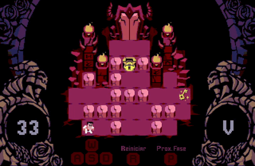

# (ISC - 2021-1): Helltaker

<h1 align="center">
    
</h1>

Implementação do jogo Helltarker em Assembly RISC-V.

* [Sobre o Projeto](#sobre-o-projeto)
* [Execução](#execução)
    * [Usando o FPGRARS](#usando-o-fpgrars)
    * [Usando o RARS](#usando-o-rars)
    * [Controles e Como Jogar](#controles-e-como-jogar)
* [Funcionalidades](#funcionalidades)
* [Showcase](#showcase)
* [Créditos](#créditos)

---

## Sobre o projeto

O projeto se trata de uma recriação do jogo [Helltaker](https://store.steampowered.com/app/1289310/Helltaker/), originalmente criado e publicado por [Łukasz Piskorz (vanripperart)](https://twitter.com/vanripperart), utilizando como base a ISA RV32IMF do Assembly [RISC-V](https://riscv.org/). O jogo foi desenvolvido como projeto final da discplina de Introdução aos Sistemas Computacionais (ISC) ofertada pela [Universidade de Brasília](https://www.unb.br/) durante o semestre 2021/1.

---
## Execução

Para executar o jogo é possível utilizar a ferramenta [RARS](https://github.com/TheThirdOne/rars) ou o [FPGRARS](https://github.com/LeoRiether/FPGRARS), porém o FPGRARS é mais recomendado.

### Usando o FPGRARS

Baixe o executável da última versão ou utilize o FPGRARS contido no repositório, e execute o arquivo `Helltaker.s` através do comando `./fpgrars Helltaker.s` no terminal ou arrastando o `.s` no executável.

### Usando o RARS

Use o `Rars15_Custom2.jar` contido no repositório, abra o arquivo `Helltaker.s`, na barra de menu superior clique em "Run" e depois selecione a opção "Assemble" para montar o programa (ou aperte F3).

Em seguida, na barra de menu superior clique em "Tools" e selecione as opções "Bitmap Display" e "Keyboard and Display MMIO Simulator", conecte ambas ao programa clicando em "Connect to Program".

Por fim, na opção "Run" clique em "Go" para executar o jogo (ou aperte F5). O jogo será renderizado na janela da ferramenta "Bitmap Display" e todos os inputs do teclado devem ser digitados na parte inferior da janela do "Keyboard and Display MMIO Simulator".

### Controles e Como Jogar

Nos menus use `w`, `a`, `s` e `d` para movimentar entre as opções e `ENTER(↵)` para selecionar uma. 

Nas fases use também `w`, `a`, `s` e `d` para movimentar o personagem, sendo que `r` pode ser usado para reiniciar o nível e `p` para avançar para a próxima fase.

---
## Funcionalidades    

Assim como no jogo original, nessa adaptação a história segue a jornada de um herói conhecido apenas como “O
Helltaker” em uma busca para realizar seu sonho de construir um harém demoníaco. Para isso, o herói, controlado pelo jogador, deverá descer até as profundezas do inferno, resolvendo uma série de quebra-cabeças de dificuldade crescente para ter a chance de recrutar uma garota demônio para o seu harém. 

    

O jogo possui 5 fases e cada uma delas apresenta um desafio diferente. O jogador deve ser capaz de manipular a fase a seu favor para conseguir remover ou desviar de obstáculos (blocos de pedra e espinhos), evitar ou eliminar inimigos (esqueletos) e encontrar chaves para destrancar portas para conseguir encontrar o caminho certo antes que seus movimentos acabem. Por fim, cada demônio tem uma personalidade diferente, sendo assim o jogador deverá responder cada uma de maneira apropriada para ter a chance de conquista-las.

---
## Showcase

### Fase 1

    

### Fase 2

    

### Fase 3

    

### Fase 4

    

### Fase 5

    

---
## Créditos

* A versão original do jogo Helltaker foi desenvolvida e publicada por Łukasz Piskorz (vanripperart) ([Twitter](https://twitter.com/vanripperart), [Youtube](https://www.youtube.com/user/vanripper17)).

* A música utilizada no menu do jogo pode ser encontrada em: https://musescore.com/user/11049986/scores/6200041.

* Parte dos sprites e imagens usadas no projeto foram retiradas do próprio jogo e parte foi retirada do seguinte site: https://www.spriters-resource.com/pc_computer/helltaker/; 